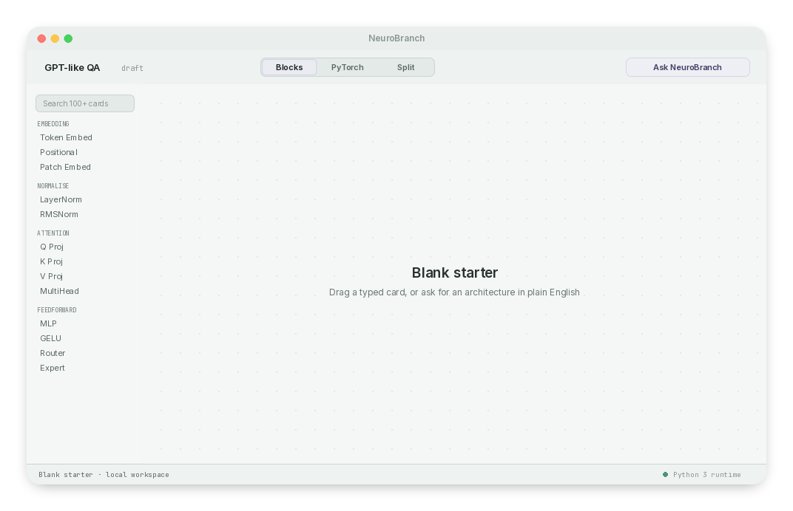
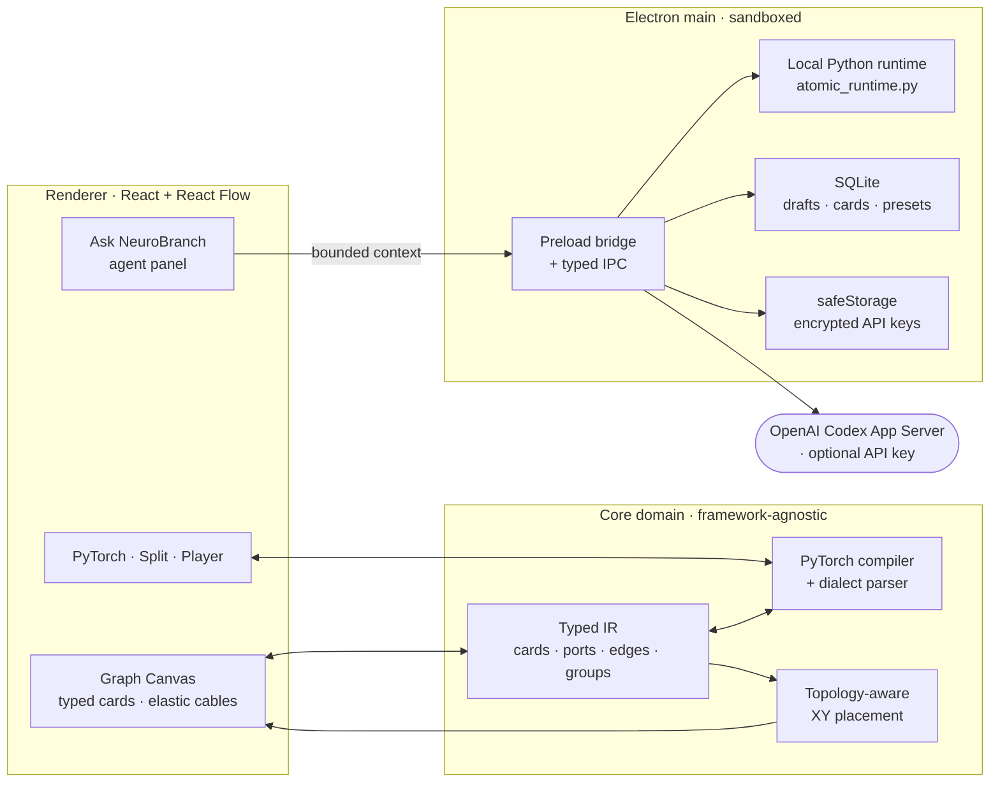
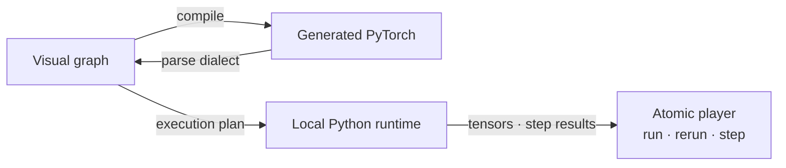
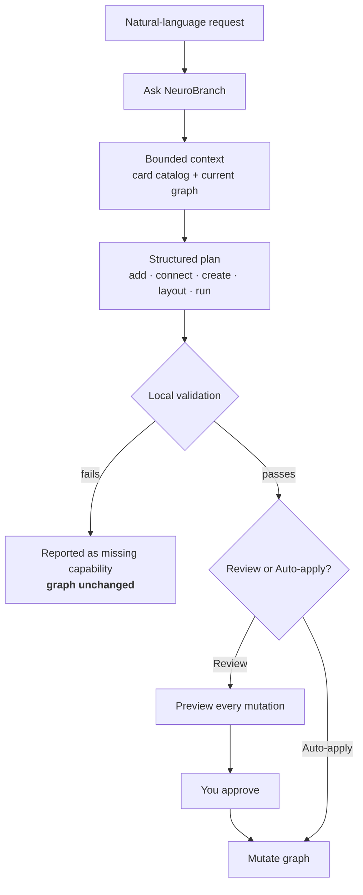
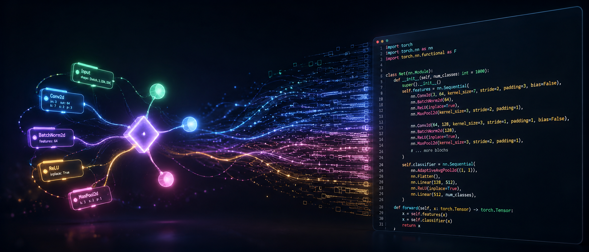

<div align="center">

# NeuroBranch

NeuroBranch turns model architecture from a wall of Python into a **living graph of small, executable cards**.
Snap typed blocks together on a canvas, watch the **PyTorch write itself**, step through execution tensor-by-tensor,
and let a **constrained AI copilot** build alongside you — using the exact same auditable tools you do.

<picture>
  <source media="(prefers-color-scheme: dark)"  srcset="public/neurobranch-hero-dark.png">
  <source media="(prefers-color-scheme: light)" srcset="public/neurobranch-hero-light.png">
  
</picture>

### Neural networks you can *see*, *touch*, and *run* — one typed block at a time.


</div>

---

## Why NeuroBranch?

Neural-network code is easy to **copy** and hard to **understand**. Real architectures bury their tensor
contracts, parallel branches, routing decisions, and execution order inside large Python files. You can read the
code and still not *see* the model.

NeuroBranch flips that around:

> **A model is a graph of small, typed, executable cards — not an opaque script.**
> Everything you can do, an AI assistant must do the same way: through explicit, validated, observable tools.

That single idea drives every design decision: typed cards instead of a free-form code editor, two-way sync
between the graph and generated PyTorch, deterministic layout that keeps parallel lanes readable, and an agent
that can only propose changes that pass local validation before they ever touch your graph.

<sub>NeuroBranch is a personal project I've been building and refining over a long stretch of time — an early,
evolving MVP that runs entirely on your own machine.</sub>

---

## What you actually do with it

| | |
|---|---|
| **Compose** | Drag 100+ typed, executable cards onto a canvas and wire them with typed "elastic" cables. Incompatible ports simply won't connect. |
| **Sync** | The graph compiles to readable PyTorch — and edits to supported PyTorch atoms flow *back* into the graph. |
| **Run** | Execute the graph in a real local Python runtime: run, rerun, reset, or step through it tensor-by-tensor. |
| **Ask** | Describe an architecture in plain English; **Ask NeuroBranch** plans it, wires only compatible ports, and hands you an auditable plan to review or auto-apply. |
| **Extend** | Build your own reusable, safe `nn.Module` cards in a dedicated full-canvas studio. |
| **Keep** | Drafts, custom cards, optimizers, and presets persist locally in SQLite and survive app updates. |

---

## How it works

NeuroBranch keeps **four surfaces in perfect sync** — the visual graph, the tensor contracts, the generated
PyTorch, and the live execution — all backed by one typed intermediate representation.



### Two-way graph ⇄ PyTorch, then execution

The graph is the source of truth, but it isn't a drawing — it compiles to real PyTorch and runs on a real
interpreter. Supported semantic atoms round-trip both directions.



### The Ask NeuroBranch agent loop

The planner is **deliberately constrained**. It never edits raw code — it sees a bounded view of the catalog and
your current graph, returns a strict structured plan, and *nothing changes* until local validation passes and
(optionally) you approve it.



Existing architectures stay **read-only in parallel mode**, so the agent can build a new model beside your work
instead of overwriting it.

---

## Feature tour



<details>
<summary><b>Composition & catalog</b></summary>

- 100+ typed, executable model cards grouped into useful families.
- Starters: Blank, GPT-like, learned-MoE, token-routing, and TR 300M.
- Media starters: executable Vision Transformer, multimodal image-editing, spatiotemporal video, and audio
  encoders — with dedicated media atomics and tokenizer pipelines.
- Drag-and-drop composition with typed elastic cables.
- Deterministic, topology-aware XY placement that preserves parallel lanes and minimizes crossings.
- Natural-language card search across native atomics and graph inputs.
- Contextual construction palettes whose operations and typed plugs follow the selected category.
</details>

<details>
<summary><b>PyTorch, execution & export</b></summary>

- Two-way graph/PyTorch synchronization for supported semantic atoms.
- Atomic PyTorch player: run, rerun, reset, and step-by-step execution.
- Reusable-card studio with **Blocks**, **PyTorch**, and **Split** views, category-aware composition, typed
  plugs, agent assistance, and a safe generated `nn.Module` preview.
- Export a vector **SVG** diagram or the generated **Python** through the desktop save dialog.
- Dedicated **Tokenizer** and **Training** studios.
</details>

<details>
<summary><b>Ask NeuroBranch (agent)</b></summary>

- Adds available blocks, connects compatible ports, or clearly reports missing capabilities.
- Separate **Review** (preview every mutation) and **Auto-apply** (only operations that pass validation) modes.
- Parallel-aware layout and multi-architecture composition **without overwriting the current canvas**.
- On desktop: **Continue with ChatGPT** via the official OpenAI Codex App Server, plus an optional per-user
  OpenAI API-key fallback stored with Electron encrypted storage.
</details>

<details>
<summary><b>Persistence & workspaces</b></summary>

- SQLite-backed graph drafts, cards, optimizer configurations, and user presets.
- Separate add and edit modes; existing cards open in a central editor, user-created library cards can be deleted.
- Workspaces are preserved across application updates.
</details>

---

## Quick start — one command

The commands below always install the latest published release. Each bootstrap script downloads the small native
Setup helper, verifies its published **SHA-256** digest, and launches the source-first installer.

**macOS (Apple silicon)** — Terminal:
```bash
curl -fsSL https://github.com/sanjayrohith/NeuroBranch/releases/latest/download/install-NeuroBranch-macos.sh | bash
```

**Windows (x64)** — PowerShell:
```powershell
irm https://github.com/sanjayrohith/NeuroBranch/releases/latest/download/install-NeuroBranch-windows.ps1 | iex
```

**Linux (x64)** — terminal:
```bash
curl -fsSL https://github.com/sanjayrohith/NeuroBranch/releases/latest/download/install-NeuroBranch-linux.sh | bash
```

**NeuroBranch Setup** then fetches the latest tagged source, provisions its own verified Node.js runtime, and
**builds the Electron app locally** — not an opaque prebuilt binary — without touching your private workspace
data. Graph editing and the player need no account.

<details>
<summary>Supported packages & first-launch notes</summary>

- macOS 12+ on Apple silicon: `NeuroBranch-Setup-arm64.dmg`
- Windows 10/11 x64: `NeuroBranch-Setup-x64.exe`
- Linux x64: `NeuroBranch-Setup-x64.AppImage` (generic AppImage, per-user install)

Setup packages are currently unsigned, so macOS Gatekeeper or Windows SmartScreen may prompt on first launch. The
one-command path runs the checksum-verified helper directly; the DMG, EXE, and AppImage are also available from
[GitHub Releases](https://github.com/sanjayrohith/NeuroBranch/releases/latest) for manual installation. Internet
access and a few minutes are needed for the first build; later updates reuse the managed Node.js runtime, and
Setup verifies and updates itself before rebuilding when a newer helper exists.
</details>

### First run — a 5-step tour

1. Open **Blank starter** and drag typed cards from the block library.
2. Open **Ask NeuroBranch**, choose **New parallel** + **Auto apply**, and request a compact GPT-like QA architecture.
3. In **Settings → Agent**, pick **Continue with ChatGPT** — or add an OpenAI API key (encrypted locally with
   Electron `safeStorage`, never returned to the renderer).
4. Run the graph with the atomic player, then inspect the **PyTorch** and **Split** views.
5. Save the workspace as a preset and export it as **SVG** or generated **Python**.

> Graph editing, presets, PyTorch inspection, local execution, and export all work **without any account or API
> key**. Only Ask NeuroBranch needs the ChatGPT connection or an OpenAI key.

---

## Tech stack

| Layer | Technology |
|---|---|
| Desktop shell | **Electron** (secure preload bridge + typed IPC) |
| UI | **React 19** + **TypeScript**, **Vite**, `@xyflow/react` graph canvas, SCSS design tokens |
| Domain core | Framework-agnostic typed IR, PyTorch compiler/dialect, topology-aware layout |
| Execution | Local **Python 3** runtime (`scripts/atomic_runtime.py`) via a narrow IPC bridge |
| Persistence | **SQLite** workspaces · Electron `safeStorage` for encrypted keys |
| AI | **OpenAI Codex App Server** (ChatGPT sign-in) · optional OpenAI API key |
| Installer | Source-first **Tauri** bootstrap (Rust) |

---

## Development

**Requirements:** Node.js + npm · Python 3 with the packages in `requirements-runtime.txt` · macOS, Windows, or Linux.

```bash
npm install
npm run electron:dev
```

Validation suite:

```bash
npm test          # full vitest run
npm run lint      # oxlint
npm run test:desktop
```

<details>
<summary><b>Desktop builds & source-first Setup packaging</b></summary>

```bash
npm run electron:start            # build everything and launch Electron

npm run package:mac:dir           # unpacked macOS dev app
npm run package:win:dir           # unpacked Windows dev app
npm run package:linux:dir -- --x64  # unpacked Linux dev app

# Public source-first Tauri Setup package:
npm ci --prefix apps/bootstrap-installer
npm run build:mac   --prefix apps/bootstrap-installer   # macOS
npm run build:win   --prefix apps/bootstrap-installer   # Windows
npm run build:linux --prefix apps/bootstrap-installer   # Linux AppImage
```

Artifacts are written to `release/`. The Python atomic runtime is bundled as an Electron extra resource so
packaged builds don't resolve it through the application archive.
</details>

<details>
<summary><b>Guided agent demo</b></summary>

After connecting ChatGPT or adding an API key in the app:

```bash
npm run demo:agent
```

The sequence opens with a conversational `Hello`, builds a compact GPT-like QA graph, then upgrades it into a
token-routed residual MoE before running it and showing synchronized PyTorch. Use `-- --keep-open` while
recording, or `--no-cues` for a clean voice-over-only capture. Full walkthrough:
[`docs/demo-walkthrough.md`](docs/demo-walkthrough.md).
</details>

<details>
<summary><b>Publish a desktop release</b></summary>

The package version is the release source of truth. After release changes land on `main`:

```bash
npm version patch
git push origin main --follow-tags
```

The `Desktop release` workflow verifies the `vX.Y.Z` tag matches both the application and Setup versions,
validates the project, builds the Apple-silicon DMG, Windows x64 EXE, and Linux x64 AppImage, and publishes them
under stable filenames. Setup then builds Electron locally from that latest tagged release; existing installs
update from **Settings → General**.
</details>

<details>
<summary><b>Source-first installation layout</b></summary>

- Setup state and its managed Node.js runtime live in the OS local application-data directory.
- macOS → `~/Applications/NeuroBranch.app`; Windows → `%LOCALAPPDATA%/Programs/NeuroBranch`;
  Linux → `${XDG_DATA_HOME:-~/.local/share}/NeuroBranch/app` with a per-user `.desktop` launcher.
- One previous application directory is retained for rollback.
- Before each update, the installed Setup helper SHA-256-verifies its own latest native helper and relaunches if
  the updater itself changed.
- SQLite workspaces, custom cards, and optimizer presets live in Electron's separate user profile and are never
  replaced by an application update.
- The updater accepts no repository or command from the renderer — its source repo and build commands are fixed
  in the native Setup code.
</details>

---

## Security model

- **Renderer isolation** enforced through the Electron preload bridge.
- **ChatGPT OAuth & token refresh** are owned by the bundled Codex App Server; session tokens never pass through
  the renderer.
- **OpenAI keys** are encrypted with Electron `safeStorage` and never exposed to the renderer after saving.
- **Ask NeuroBranch** receives a bounded graph context and must return a strict structured plan.
- **Custom PyTorch cards** accept only explicitly supported `torch.nn` constructors and literal arguments.
- **Generated graphs** run through the dedicated local Python runtime — never arbitrary shell evaluation.

---

<div align="center">
<sub>Built with typed contracts, deterministic layout, and a healthy distrust of opaque code — by
<a href="https://github.com/sanjayrohith">@sanjayrohith</a>. Licensed under Apache-2.0.</sub>
</div>
